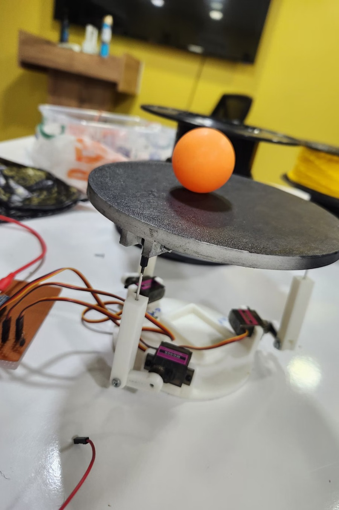
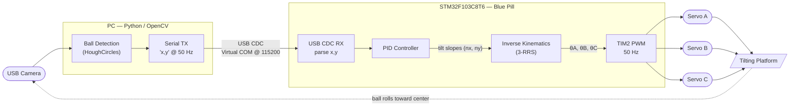
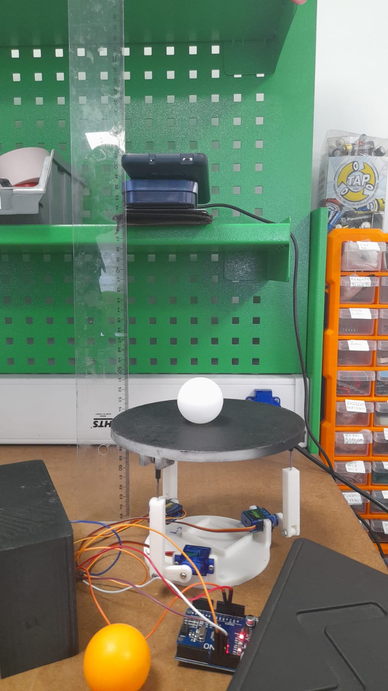
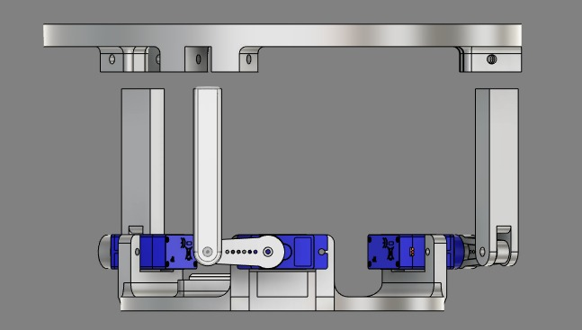
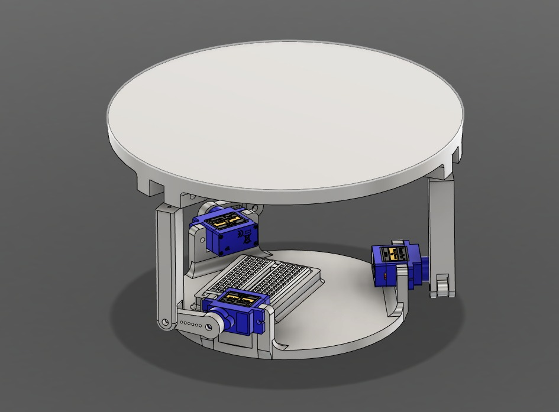
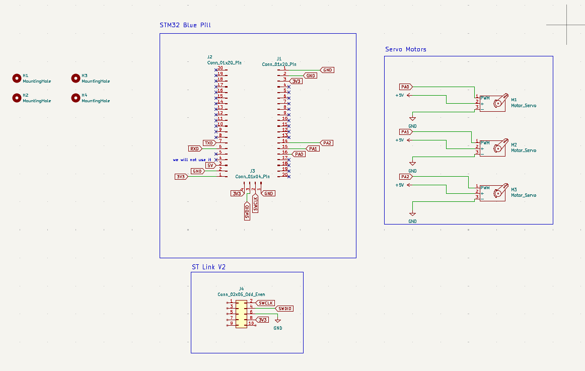
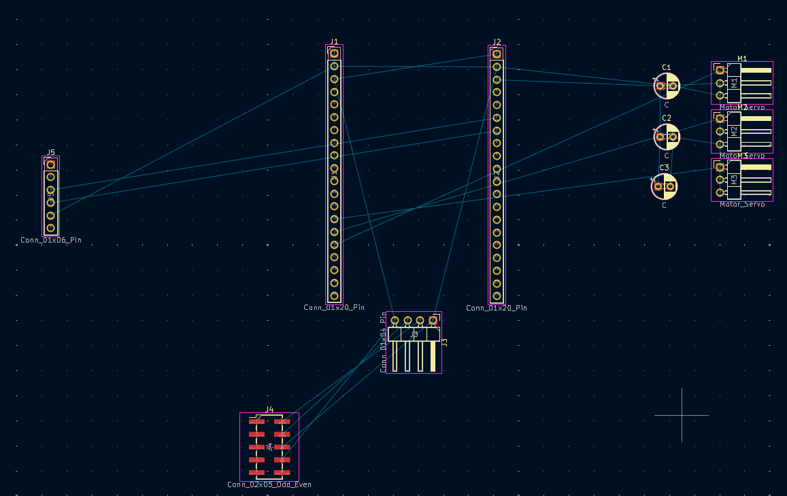
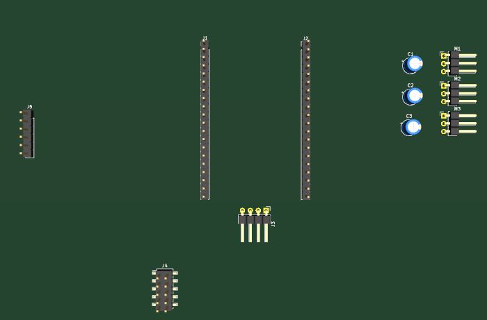

# Real-Time Ball-Balancing Robot

A closed-loop **ball-on-plate** balancing platform. A camera tracks a ball on a circular plate, and a **3-RRS parallel manipulator** driven by three servos tilts the plate to roll the ball back to the center — in real time.

A PC runs the computer-vision pipeline (OpenCV) and streams the ball's pixel coordinates over USB to an **STM32F103C8T6 "Blue Pill"**, which closes the loop with a **PID controller** and an **inverse-kinematics** solver that converts the desired plate tilt into the three servo angles.

<p align="center">
  
</p>

---

## Table of Contents

- [How It Works](#how-it-works)
- [Demo & Gallery](#demo--gallery)
- [Repository Structure](#repository-structure)
- [Hardware](#hardware)
  - [Bill of Materials](#bill-of-materials)
  - [Schematic & PCB](#schematic--pcb)
  - [STM32 Pinout](#stm32-pinout)
- [Mechanical Design](#mechanical-design)
- [Computer Vision](#computer-vision)
- [Control System (PID)](#control-system-pid)
- [Inverse Kinematics](#inverse-kinematics)
- [System Modeling](#system-modeling)
- [Getting Started](#getting-started)
- [Tuning Guide](#tuning-guide)
- [Roadmap](#roadmap)
- [Team](#team)
- [License](#license)

---

## How It Works

The system is a continuous feedback loop running at **50 Hz**:



| Stage | Where | What happens |
|-------|-------|--------------|
| **1. Detect** | PC (Python) | A webcam frame is processed with OpenCV. The ball is found with a Hough circle transform, returning its `(x, y)` pixel position. |
| **2. Transmit** | PC → MCU | The coordinates are sent as an ASCII string `"x,y\n"` over a USB CDC virtual COM port at up to 50 Hz. |
| **3. Compute error** | STM32 | The pixel error is `error = center − ball`, where the center is `(320, 240)`. |
| **4. PID** | STM32 | A discrete PID controller turns the error into a desired **platform tilt slope** `(nx, ny)`, saturated for safety. |
| **5. Inverse kinematics** | STM32 | The tilt slope and platform height are converted into three servo joint angles `(θA, θB, θC)`. |
| **6. Actuate** | STM32 → servos | Angles are mapped to PWM and written to the three servos via TIM2, tilting the plate so the ball rolls back toward center. |

---

## Demo & Gallery

| The finished robot | Assembled controller board |
|:---:|:---:|
|  |  |

| Bench setup | CAD — isometric | CAD — side |
|:---:|:---:|:---:|
|  |  |  |

> A full project presentation (mechanical design, system identification, Simulink models, results) is included at
> [`docs/presentation/Real-Time-Ball-Balancing-Robot.pptx`](docs/presentation/Real-Time-Ball-Balancing-Robot.pptx).

---

## Repository Structure

```
ball-balancing-robot/
├── README.md                     ← you are here
├── LICENSE
├── .gitignore
│
├── vision/                       # PC-side computer vision (Python)
│   ├── ball_tracker.py           # main tracker: detects ball, streams coords over serial
│   ├── circle_calibration.py     # helper to align the camera with the physical plate
│   ├── requirements.txt
│   └── README.md
│
├── firmware/
│   ├── arduino/                  # Reference prototype (Arduino / STM32duino)
│   │   ├── ball_balancer/
│   │   │   ├── ball_balancer.ino # control loop: serial → PID → IK → servos
│   │   │   ├── InverseKinematics.cpp
│   │   │   └── InverseKinematics.h
│   │   └── README.md
│   │
│   └── stm32/                     # Deployed firmware (STM32CubeIDE / HAL)
│       ├── usb_cdc.ioc           # CubeMX configuration (TIM2 PWM + USB CDC)
│       ├── STM32F103C8TX_FLASH.ld
│       ├── .cproject / .project / .mxproject
│       └── README.md             # ⚠️ how to add the Core/Drivers/Middlewares sources
│
├── hardware/
│   └── README.md                 # PCB, power, wiring notes
│
└── docs/
    ├── images/                   # photos, CAD renders, schematic, PCB
    └── presentation/             # full project slide deck (.pptx)
```

---

## Hardware

### Bill of Materials

| Qty | Component | Notes |
|:---:|-----------|-------|
| 1 | **STM32F103C8T6 "Blue Pill"** | Main controller. 72 MHz Cortex-M3. |
| 3 | **9g micro servos** | Drive the three RRS legs (e.g. SG90 / MG90S class). |
| 1 | **ST-Link V2** | For flashing & SWD debugging the Blue Pill. |
| 1 | **USB webcam** | Mounted above the plate, looking straight down. |
| 1 | **External 5 V power adapter** | Powers the servos (do **not** power servos from the Blue Pill's regulator). |
| 1 | **Custom PCB** | Routes signals and 5 V power to the servos (KiCad design). |
| 1 | **Circular plate + ball** | Flat plate where the ball rolls (a standard ping-pong ball). |
| 1 | **Perfboard / protoboard** | The final build hand-wires the Blue Pill and servo headers on perfboard (see note below). |
| — | **3D-printed parts** | Base, legs, servo horns, platform mounts. |

### Schematic & PCB

| Schematic | PCB layout | PCB 3D render |
|:---:|:---:|:---:|
|  |  |  |

The custom PCB acts as a carrier/breakout for the Blue Pill (`J1`, `J2`), the servo headers (`M1`–`M3`), the ST-Link SWD header (`J4`), and an auxiliary header (`J5`), with the servo signal lines and a shared external 5 V/GND rail.

> **Design vs. build.** The board above is the **KiCad design**. The **final working build** uses an STM32 Blue Pill hand-soldered onto perfboard with jumper wires out to the three servos and the ST-Link — the images below. The pin assignments are identical; only the physical routing differs.
>
> <p align="center">
>   
> </p>

### STM32 Pinout

The firmware uses **TIM2** for three hardware-PWM servo channels and the on-chip **USB peripheral** as a CDC virtual COM port.

| Pin | Peripheral / Function | Connected to |
|-----|-----------------------|--------------|
| **PA0** | `TIM2_CH1` — PWM | Servo **A** (Leg A / M1) signal |
| **PA1** | `TIM2_CH2` — PWM | Servo **B** (Leg B / M2) signal |
| **PA3** | `TIM2_CH4` — PWM | Servo **C** (Leg C / M3) signal |
| **PA11** | `USB_DM` | USB D− → PC |
| **PA12** | `USB_DP` | USB D+ → PC |
| **PA13** | `SWDIO` | ST-Link V2 |
| **PA14** | `SWCLK` | ST-Link V2 |
| **PC13** | GPIO output | On-board LED |
| **5V (ext.)** | Power | Servo VCC (external 5 V adapter) |
| **GND** | Ground | Common ground (PC, MCU, servos) |

**PWM timing.** TIM2 is clocked so that one count = 1 µs (`Prescaler = 72−1`) with a period of 20,000 counts (`Period = 20000−1`) → a **20 ms / 50 Hz** servo frame. Pulse widths in the ~1000–2000 µs range set servo position.

> **Note on pin numbering.** The KiCad schematic labels the servos on PA0/PA1/**PA2**, while the shipped CubeMX configuration drives them on PA0/PA1/**PA3** (TIM2 channels 1, 2, 4). The firmware is the source of truth — use **PA0 / PA1 / PA3**.

---

## Mechanical Design

The platform is a **3-RRS parallel manipulator** (each leg: a base **R**evolute joint actuated by a servo → a link → a **S**pherical joint at the moving plate; "RRS" denotes the joint chain per leg). Three legs spaced 120° apart give the plate the two tilt degrees of freedom needed to steer the ball, plus a controllable height.

The inverse-kinematics solver is parameterized by four lengths (all in **centimeters**), set in the firmware:

| Symbol | Meaning | Value (cm) |
|:------:|---------|:----------:|
| `d` | Base center → corner distance | 5.70 |
| `e` | Platform center → corner distance | 8.50 |
| `f` | Link 1 length (servo horn) | 3.10 |
| `g` | Link 2 length (connecting rod) | 9.66 |
| `hz` | Baseline platform height | 10.25 |

**Servo calibration** (neutral angle = plate level), from the firmware:

| | Leg A | Leg B | Leg C |
|---|:---:|:---:|:---:|
| Neutral angle | 74° | 97° | 83° |
| Direction sign | +1 | +1 | +1 |
| Safe travel limits | \[40°, 100°\] | \[40°, 100°\] | \[40°, 100°\] |

> Design goals: a stiff plate, **known neutral geometry** so the IK baseline is exact, and conservative servo travel limits so the mechanism can never drive itself into a hard stop.

---

## Computer Vision

The vision script ([`vision/ball_tracker.py`](vision/ball_tracker.py)) detects the ball and streams its position. The pipeline:

1. **Pre-process** — convert the frame to grayscale and apply a 9×9 Gaussian blur to suppress noise.
2. **Detect** — run a Hough circle transform (`cv2.HoughCircles`) to find circular candidates within a radius band.
3. **Validate** — for the white ball, the mean brightness *inside* each candidate circle is checked, rejecting non-ball circles. _(An alternative HSV color-threshold path can be used for a colored ball — see the slide deck.)_
4. **Overlay & calibrate** — a fixed reference circle is drawn at the image center `(320, 240)` so the camera frame can be physically aligned with the plate. Use [`circle_calibration.py`](vision/circle_calibration.py) to do this alignment.
5. **Transmit** — when the ball is found, the script sends `"x,y\n"` over the serial port (`COM11` @ 115200 by default). A status overlay shows the live connection state and detected pixel coordinates.

> **Set your serial port** at the top of `ball_tracker.py` (`serial_port = "COM11"`). On Linux/macOS this looks like `/dev/ttyACM0` or `/dev/tty.usbmodemXXXX`.

---

## Control System (PID)

The controller runs on a fixed sample time of $\Delta t = 20\ \text{ms}$ (50 Hz). The error is the offset of the ball from the image center, computed independently on each axis:

$$
e_x = c_x - b_x, \qquad e_y = c_y - b_y
$$

where $(c_x, c_y) = (320, 240)$ px is the target center and $(b_x, b_y)$ is the detected ball position.

A discrete PID is evaluated per axis, using **trapezoidal integration**:

$$
I_k = I_{k-1} + \left(e_k + e_{k-1}\right)\,\Delta t
$$

$$
D_k = \frac{e_k - e_{k-1}}{\Delta t}
$$

$$
u_k = K_p\, e_k + K_i\, I_k + K_d\, D_k
$$

The output $u_k$ is the **commanded plate tilt slope** $(n_x, n_y)$, clamped to a safe range to bound how far the plate can tilt:

$$
u_k \in \left[-s_{\max},\ +s_{\max}\right], \qquad s_{\max} = 0.6
$$

If no fresh coordinate arrives within ~500 ms, the controller commands the plate flat as a failsafe.

**Gains.** The PID gains were tuned iteratively; the value of starting from a small proportional gain and adding derivative damping is documented inline in the firmware. They are exposed as plain constants (`kp`, `ki`, `kd`) so you can re-tune for your own servos, plate friction, and camera latency — see the [Tuning Guide](#tuning-guide).

---

## Inverse Kinematics

Inverse kinematics converts the **desired plate pose** — a unit normal vector $\hat{n} = (n_x, n_y, n_z)$ and a height $h_z$ — into the **servo angle required for each leg**.

For each leg the solver evaluates a closed-form expression (derived from the leg geometry $d, e, f, g$) and returns the joint angle $\theta$:

$$
\theta_{\text{leg}} = \texttt{machine.theta}(\text{leg},\ h_z,\ n_x,\ n_y)
$$

The geometric angle is then mapped to a servo command using the per-leg neutral and direction calibration:

$$
\theta_{\text{servo}} = \theta_{\text{neutral}} + s \cdot \operatorname{round}\!\left(\theta - \theta_0\right)
$$

where $\theta_0$ is the baseline angle for a perfectly level plate (computed once at startup) and $s \in \{-1, +1\}$ sets the rotation direction. Each result is finally constrained to the safe travel limits before being written to the servo.

**End-to-end signal flow:**

$$
\underbrace{(b_x, b_y)}_{\text{pixels}} \;\xrightarrow{\text{PID}}\; \underbrace{(n_x, n_y)}_{\text{tilt slopes}} \;\xrightarrow{\text{IK}}\; \underbrace{(\theta_A, \theta_B, \theta_C)}_{\text{joint angles}} \;\xrightarrow{\text{map + PWM}}\; \text{servos}
$$

The full derivation lives in [`InverseKinematics.cpp`](firmware/arduino/ball_balancer/InverseKinematics.cpp).

---

## System Modeling

Beyond hand-tuning, the servos were characterized to enable model-based control design (see the slide deck for figures):

- **Data collection** — the servo's built-in position feedback was logged as `(time [ms], commanded angle [deg], measured angle [deg])`.
- **System identification** — a black-box fit produced a transfer function (settling-time / `Ts`) model of the servo response.
- **Simulink** — the closed loop was modeled both *without* and *with* the inverse-kinematics block, and the step responses were compared against the physical system.

---

## Getting Started

### 1. Vision (PC)

```bash
cd vision
pip install -r requirements.txt
# Edit ball_tracker.py and set serial_port to your board's COM/tty port
python ball_tracker.py
```

A window opens showing the camera feed, the reference circle, the detection, and an `STM: Connected/Disconnected` overlay. Press **`q`** or **`Esc`** to quit. Use `circle_calibration.py` first if you need to physically align the camera with the plate.

### 2. Firmware — STM32 (recommended / deployed)

1. Open **STM32CubeIDE** → *File ▸ Open Projects from File System…* → select `firmware/stm32/`.
2. (Optional) Open `usb_cdc.ioc` in CubeMX to review the TIM2 + USB CDC configuration.
3. Build, connect the **ST-Link V2** to the SWD header, and flash.
4. The board enumerates as a USB **Virtual COM Port** — note the port number and put it in `ball_tracker.py`.

> ⚠️ **Before this builds**, the generated source folders (`Core/`, `Drivers/`, `Middlewares/`, `USB_DEVICE/`) must be present. See **[`firmware/stm32/README.md`](firmware/stm32/README.md)** — those folders are *not* committed here yet, and the README explains exactly how to add them.

### 3. Firmware — Arduino (reference prototype)

```text
Open firmware/arduino/ball_balancer/ball_balancer.ino in the Arduino IDE
→ install the Servo library
→ select your board, then upload
```

This sketch contains the same control logic (PID + inverse kinematics) and is the easiest way to read and understand the algorithm. See [`firmware/arduino/README.md`](firmware/arduino/README.md).

---

## Tuning Guide

Re-tune for your own hardware in this order:

1. **Camera alignment & center.** Run `circle_calibration.py`. Make sure the reference circle is concentric with the plate and `(320, 240)` is the true target. A miscalibrated center is the #1 cause of a ball that "parks" off-center.
2. **Servo neutrals.** With the plate empty, adjust `servoNeutralA/B/C` until the plate is dead level. The IK baseline depends on this.
3. **Proportional gain `kp`.** Start small. Increase until the ball is actively pushed toward center, then back off just before it oscillates.
4. **Derivative gain `kd`.** Add a little to damp overshoot and settle the ball faster.
5. **Integral gain `ki`.** Add a *very* small amount only if the ball consistently settles slightly off-center. Too much integral causes slow oscillation/wind-up.
6. **Safety.** Keep `maxSlope` and the servo travel limits conservative until the loop is stable.

---

## Roadmap

Ideas for extending the project:

- [ ] Trajectory tracking (drive the ball along a circle/figure-8, not just to center)
- [ ] On-board vision (move detection to an MCU/SBC to remove the PC)
- [ ] Auto-tuning or model-based (LQR/state-feedback) control using the identified servo model
- [ ] Latency compensation / ball-velocity estimation (Kalman filter)
- [ ] Publish the KiCad source and 3D-printable STL files

---

## Team

**Team 11**

| Discipline | Member(s) |
|------------|-----------|
| Control | Mohamed Haroun, Abdulrahman Alabed |
| Computer Vision | Taqi Aldeen |
| Electronics | Ahmed Salama |
| Mechanical | Salah Hamwi |
| Embedded Systems | Abdelaziz Hassan |

---

## License

Released under the **MIT License** — see [`LICENSE`](LICENSE).
