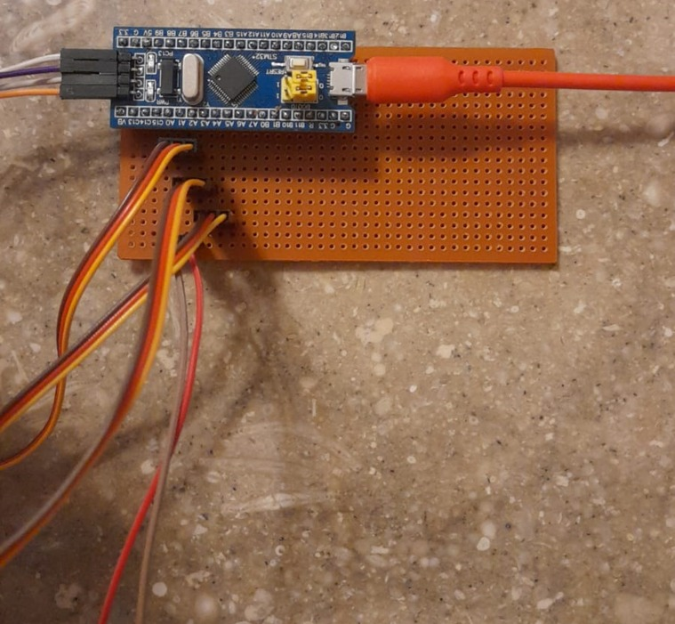

# Hardware

The custom PCB and wiring for the ball-balancing platform.

| Schematic | PCB layout | 3D render |
|:---:|:---:|:---:|
| [`schematic.png`](../docs/images/schematic.png) | [`pcb-layout.png`](../docs/images/pcb-layout.png) | [`pcb-3d.png`](../docs/images/pcb-3d.png) |

> **Design vs. build.** The KiCad board above is the *design*. The **final working build** hand-wires an STM32 Blue Pill on perfboard with jumper wires to the servos and ST-Link (same pin assignments, different physical routing):
>
> 

## What the board does

The PCB is a carrier/breakout that connects the Blue Pill to the three servos and the ST-Link, distributing the external 5 V servo power and a common ground.

| Ref | Role |
|-----|------|
| `J1`, `J2` | Blue Pill headers (2× 20-pin), carrying the MCU into the board. |
| `M1`, `M2`, `M3` | Servo connectors (signal / +5 V / GND) for legs A, B, C. |
| `J4` | ST-Link V2 SWD header (SWDIO, SWCLK, 3V3, GND). |
| `J5` | Auxiliary header. |
| `C1`–`C3` | Decoupling for the servo power rail. |

## Connections at a glance

| Signal | STM32 pin | Goes to |
|--------|-----------|---------|
| Servo A PWM | PA0 (TIM2_CH1) | `M1` signal |
| Servo B PWM | PA1 (TIM2_CH2) | `M2` signal |
| Servo C PWM | PA3 (TIM2_CH4) | `M3` signal |
| SWD | PA13 / PA14 | `J4` (ST-Link) |
| USB | PA11 / PA12 | Blue Pill USB → PC |
| Servo power | — | External **5 V** adapter → `M1/M2/M3` V+ |
| Ground | GND | Common to MCU, servos, and adapter |

> See the main [README pinout note](../README.md#stm32-pinout): the schematic labels servos on PA0/PA1/**PA2**, but the firmware drives PA0/PA1/**PA3**. Follow the firmware.

## ⚠️ Power

- **Never** power the servos from the Blue Pill's on-board regulator — three servos under load can momentarily draw amps and will brown out the MCU.
- Use a dedicated **5 V adapter** sized for your servos, and tie all grounds together (PC USB ground, MCU ground, servo-supply ground).

## To add

The KiCad source (`.kicad_pro`, `.kicad_sch`, `.kicad_pcb`) and any gerbers are not yet committed. Drop them in this folder so others can fabricate or modify the board.
